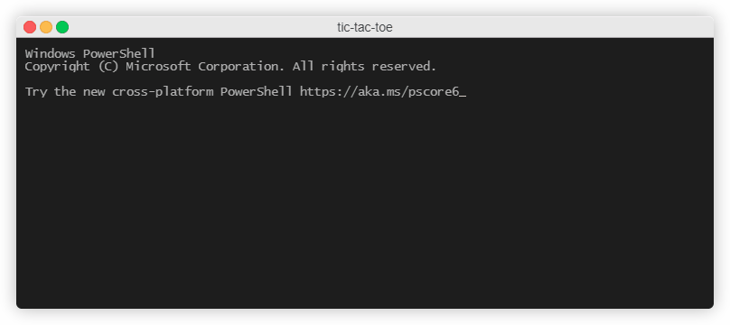

# Tic tac toe

One of my first projects in Java. Simple Tic-tac-toe game but board coordinates starts from bottom left corner.

The main purpose of writing this program was to practice planning and developing a program from scratch, using methods, handling errors, and processing user input.

## Table of contents

- [Screencast](#screencast)
- [Technologies](#technologies)
- [Status](#status)
- [Inspiration](#inspiration)

## Screencast

## Technologies

Java

## Status

Project is: _finished_

## Inspiration

Hyperskill project
